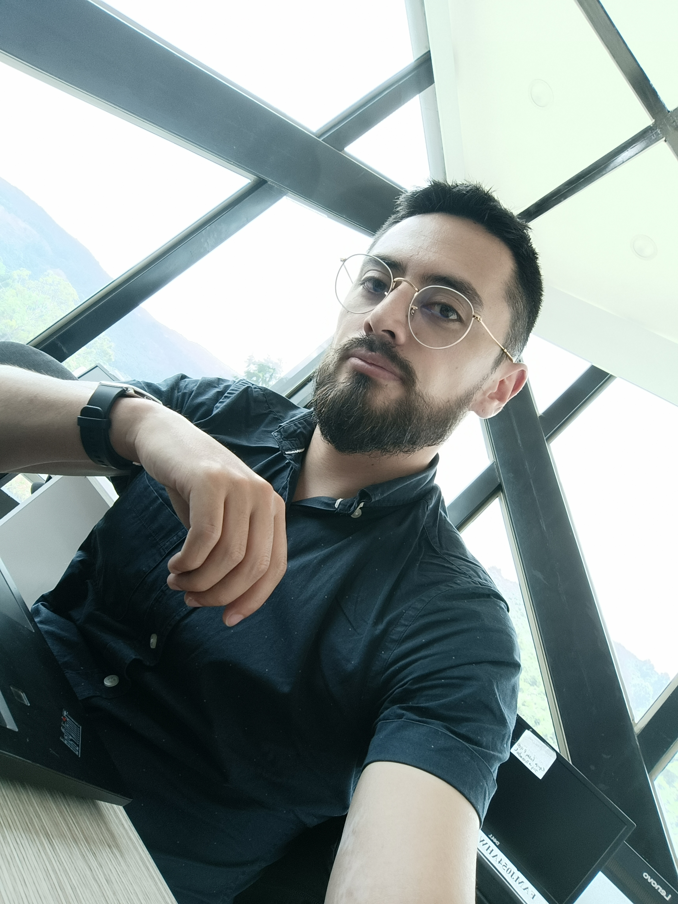

# Pixel-Dev-Squad
Repositorio - Programación para Videojuegos UNAD - Grupo 213027_3

### Germán Andrés
* **Rol de la industria:** Programador Lead / Gestor de Repositorio
* **Ubicación:** Bogotá, Colombia
* **Perfil breve:** Productor Multimedia, Desarrollador front-end y webmaster con experiencia en migraciones de plataformas, gestión de código y despliegue de interfaces. Enfocado en aplicar la lógica de programación web a la estructuración de repositorios y mecánicas de videojuegos.

