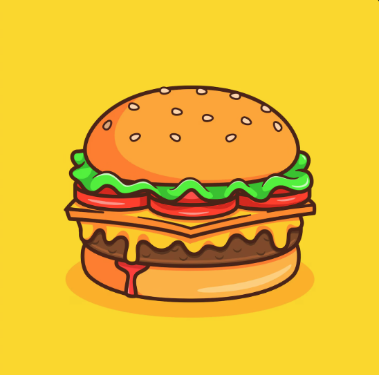
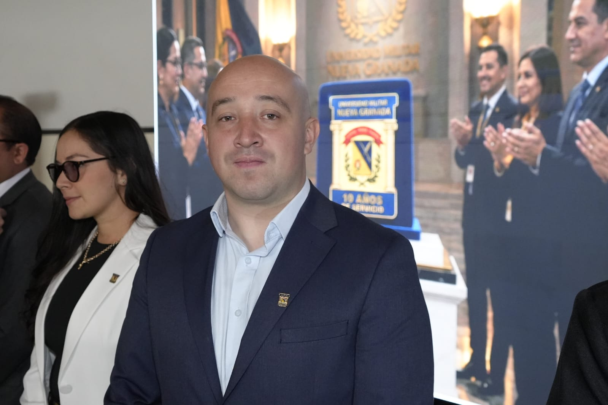
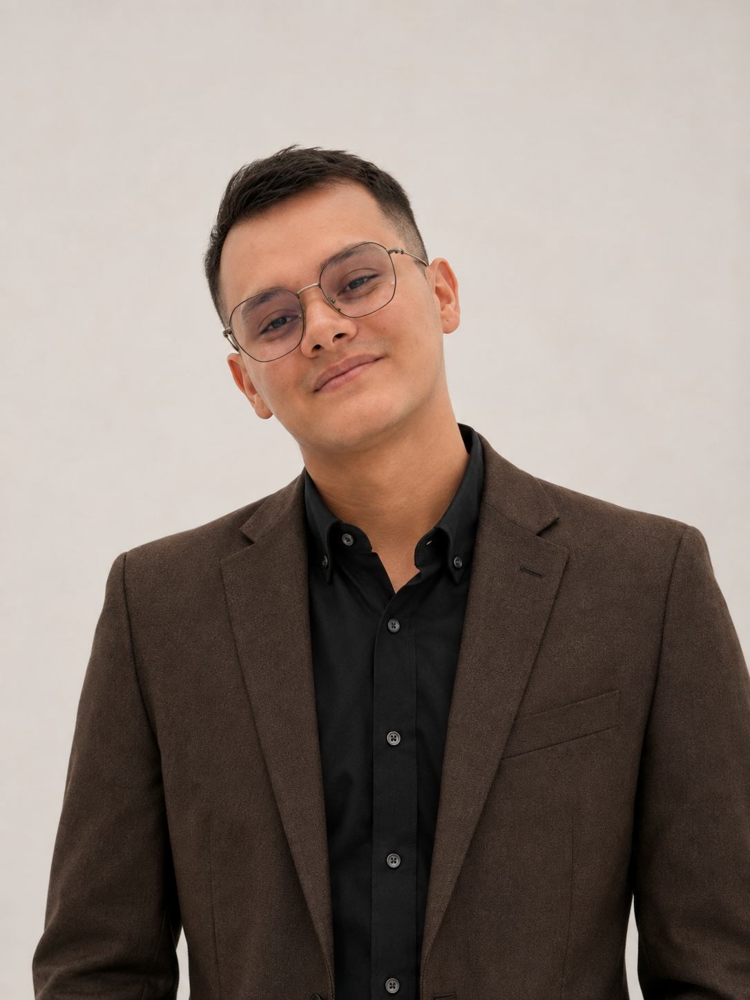

# Pixel-Dev-Squad
Repositorio - Programación para Videojuegos UNAD - Grupo 213027_3

### Germán Andrés
* **Rol de la industria:** Programador Lead / Gestor de Repositorio
* **Ubicación:** Bogotá, Colombia
* **Perfil breve:** Productor Multimedia, Desarrollador front-end y webmaster con experiencia en migraciones de plataformas, gestión de código y despliegue de interfaces. Enfocado en aplicar la lógica de programación web a la estructuración de repositorios y mecánicas de videojuegos.

### Comida favorita

**Nombre Estudiante:** Eric Daniel Molina

**Rol:** Game Desinger

**Ubicación:** Colombia, Bogota D.C.

**Perfil:** Estudiante de septimo semestre de la UNAD, mi deseo es poder crear contenido gaming basado en la cultura colombiana, actualmente soy tecnico en mantenimiento de computadores en la UMNG y mi pasion son los animes como se supondra tambien los video juegos

### Comida favorito

## Integrante

**Nombre:** Oscar Agudelo

**Rol en la industria de videojuegos:**  
Artista Técnico

**Ubicación:**  
Quetame Cundinamarca

**Perfil breve:**  
Estudiante interesado en el desarrollo de videojuegos, integrando aspectos técnicos y artísticos mediante herramientas como Unity, diseño digital y trabajo colaborativo con control de versiones.

## Plato favorito

